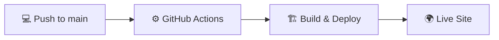

# 🌐 Portfolio Website

> Personal portfolio website built with HTML, CSS, and vanilla JavaScript. Hosted on GitHub Pages.

[](https://nawazwangde.github.io)
[](https://pages.github.com/)
[](LICENSE)

---

## 🚀 Tech Stack

<div align="center">

| Technology | Description |
|:----------:|-------------|
|  | Semantic markup |
|  | Custom Properties, Flexbox, Grid, Animations |
|  | Vanilla JS, Intersection Observer API |
|  | Icons v6.4.0 |

</div>

---

## 📁 Project Structure

```
📦 nawazwangde.github.io
┣ 📄 index.html          # Single-page application
┣ 🎨 style.css           # All styling with CSS variables
┣ ⚡ script.js           # Navigation, scroll effects, animations
┣ 📂 assets/
┃ ┣ 🖼️ profile.jpeg     # Profile image
┃ ┗ 📋 Resume.pdf       # CV download
┗ 📖 README.md
```

---

## ✨ Features

<table>
<tr>
<td width="50%">

### 🎨 Design
- 🌙 **Dark Theme** with animated gradient background
- ✨ **Glassmorphism UI** with backdrop blur effects
- 🎭 **Smooth Animations** via Intersection Observer
- 📱 **Fully Responsive** - Mobile-first approach

</td>
<td width="50%">

### ⚡ Performance
- 🚫 **Zero Dependencies** - Pure vanilla JavaScript
- 📦 **No Build Process** - Static HTML/CSS/JS
- 🚀 **Fast Loading** - Optimized assets
- 💨 **GPU Accelerated** - CSS animations

</td>
</tr>
</table>

---

## 🛠️ Local Development

### 📥 Quick Start

```bash
# Clone the repository
git clone https://github.com/nawazwangde/nawazwangde.github.io.git
cd nawazwangde.github.io
```

### 🌐 Open in Browser

<details>
<summary><b>🪟 Windows</b></summary>

```bash
start index.html
```
</details>

<details>
<summary><b>🍎 macOS</b></summary>

```bash
open index.html
```
</details>

<details>
<summary><b>🐧 Linux</b></summary>

```bash
xdg-open index.html
```
</details>

### 🔥 Using Local Server (Recommended)

<table>
<tr>
<td><b>🐍 Python</b></td>
<td>

```bash
python -m http.server 8000
```
</td>
</tr>

<tr>
<td><b>📦 Node.js</b></td>
<td>

```bash
npx http-server -p 8000
```
</td>
</tr>

<tr>
<td><b>💻 VS Code</b></td>
<td>

1. Install **Live Server** extension
2. Right-click `index.html`
3. Select **"Open with Live Server"**

</td>
</tr>
</table>

Then visit: **http://localhost:8000** 🎉

---

## 🏗️ Architecture

### 🎯 Single-Page Static Site
- ✅ No build tools or transpilation
- ✅ Direct HTML/CSS/JS served to browser
- ✅ All content in one HTML file for simplicity

### 🎨 CSS Organization
- 🎭 CSS custom properties for theming
- 📱 Mobile-first responsive breakpoints
- 🏷️ Modular class naming convention

### ⚙️ JavaScript Features
- 📌 Sticky navigation with scroll detection
- 🍔 Mobile hamburger menu toggle
- 🎬 Intersection Observer for fade-in animations
- 📊 Skill bar animations on scroll

---

## 🚀 Deployment

### 📤 Auto-Deploy Workflow



**Steps:**
1. 📝 Commit changes to `main` branch
2. ⬆️ Push to GitHub
3. ⏳ Wait 5-10 minutes for deployment
4. 🔄 Hard refresh browser (`Ctrl+Shift+R`)

**Live URL**: [nawazwangde.github.io](https://nawazwangde.github.io)

---

## 📱 Responsive Breakpoints

| 🖥️ Device | 📏 Width | 🎨 Layout |
|:--------:|:-------:|----------|
| 💻 Desktop | >900px | Full grid, horizontal nav |
| 📱 Tablet | ≤900px | Simplified grids |
| 📲 Mobile | ≤720px | Hamburger menu, stacked |
| 🔬 Small Mobile | ≤480px | Optimized spacing |

---

## 🔧 Making Changes

| Step | Action | File |
|:----:|--------|------|
| 1️⃣ | Edit content | `index.html` |
| 2️⃣ | Modify styling | `style.css` |
| 3️⃣ | Update behavior | `script.js` |
| 4️⃣ | Test locally | Open in browser |
| 5️⃣ | Commit & push | Deploy to GitHub |

---

## ⚡ Performance Metrics

<div align="center">

| Metric | Status |
|:------:|:------:|
| 🎯 **Dependencies** | -blue) |
| 📦 **Bundle Size** |  |
| ⚡ **Load Time** |  |
| 🎨 **Animations** |  |

</div>

---

## 🌐 Browser Support

<div align="center">


</div>

**Mobile Browsers:** iOS Safari, Chrome Mobile, Samsung Internet

---

## 📜 License

**Personal Portfolio** - Code available for reference and learning purposes.

---

<div align="center">

### 🔗 Quick Links

[](https://nawazwangde.github.io)
[](mailto:wangdenawaz@gmail.com)
[](https://linkedin.com/in/nawazwangde)
[](https://github.com/nawazwangde)

---

**Last Updated:** December 2025 • **Built with:** Claude AI Assistance

⭐ **Star this repo** if you find it helpful!

</div>
